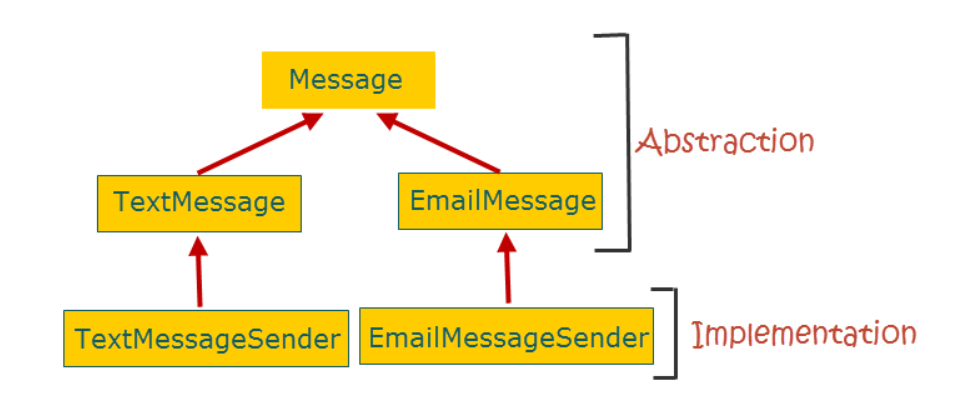
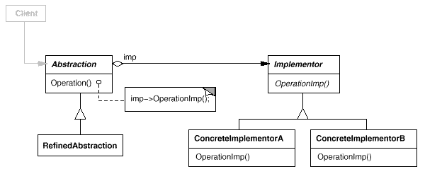
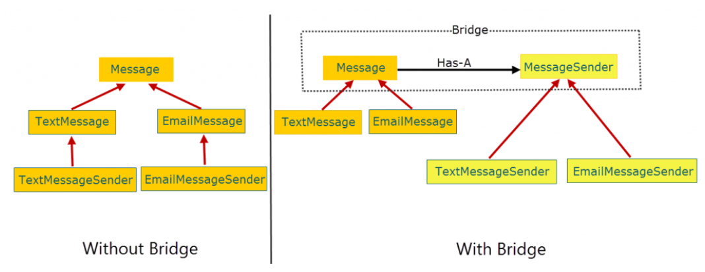

How Bridge pattern helps?

## Bridge Pattern

Decouple an abstraction from its implementation so that the two can vary independently.

The bridge pattern does it by separating the abstraction and the implementation in separate class hierarchies. 

The bridge between the class hierarchies is achieved through composition.

The Has-A relationship is achieved through composition where the abstraction maintains a reference of the implementation and forwards client requests to it.

#### UML Diagram

